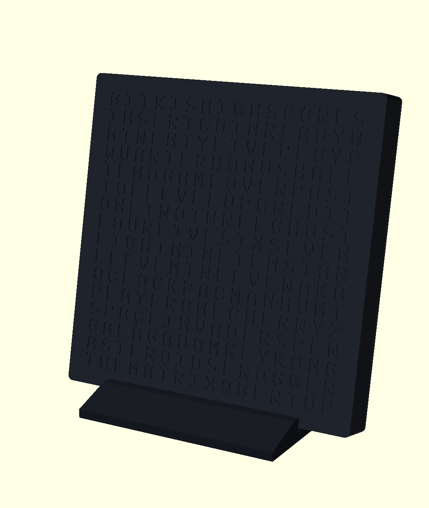
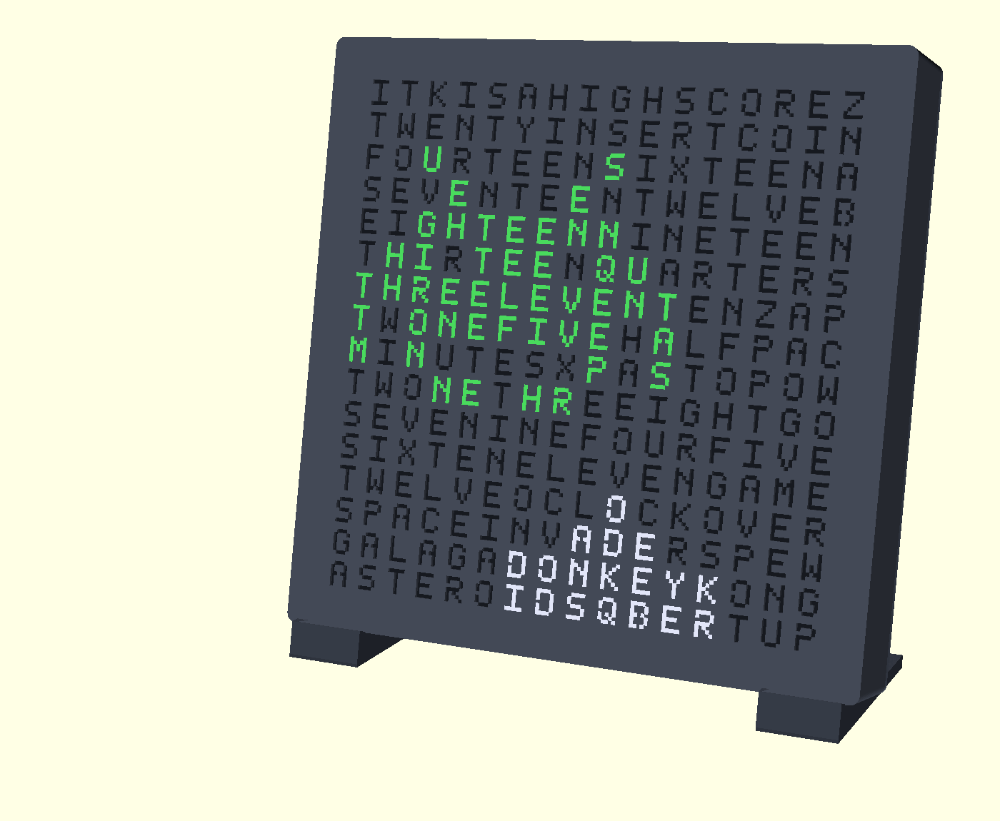

# TIME INVADERS — arcade word clock



A 16×16 word clock with an 8-bit arcade heart: the time reads as words
to the exact minute (`IT IS TWENTY THREE MINUTES PAST FOUR`), but time
changes are game events — Pac-Man eats the old time, a cannon shoots
in the new one — and the filler letters hide arcade words
(INSERT COIN, GAME OVER, plus a hall of fame: SPACE INVADERS, GALAGA,
DONKEY KONG, ASTEROIDS, Q*BERT). The enclosure is deliberately subtle —
a plain dark slab that passes at a work desk, on raked feet or
wall-mounted; the arcade lives in the light, not the shell.



Every pixel is a letter: the attract-mode sprites are drawn by lighting
grid cells, like the invader marching over the cannon above.

**▶ [Try it in your browser](https://bitbarista.github.io/word-clock-demo/simulator.html)** —
live simulator running the real firmware logic: word grid, transitions,
attract mode, hidden words.

## What you need

| Item | Notes |
|---|---|
| 16×16 WS2812B flexible panel | 160×160 mm, 10 mm pitch — the common ~£12–15 one |
| Seeed XIAO ESP32S3 (or ESP32-S3 "supermini") | either fits the internal locator |
| Snap-in USB-C power socket, **4P PD pigtail** | CHT-TS023R style; 2P/data variants won't power from C-to-C cables |
| 5 V / 3 A USB-C supply | **must present 5 V** — verify with a meter before connecting the panel |
| 2× 5.1 kΩ resistors | CC1/CC2 → GND at the socket pigtail (skip if built in) |
| 1000 µF electrolytic (≥6.3 V) | across 5 V/GND at the panel pigtail |
| 330 Ω resistor | in the data line to DIN |
| Schottky diode (1N5817/19/22) | socket 5 V → ESP32 5 V pin |
| 3 mm foam sheet | cut into 14× 8×8 mm pads |
| 4× M3×**16** self-tapping screws | shell → faceplate posts (16 mm, not 8 — see [DESIGN.md](DESIGN.md)) |
| 74AHCT125 level shifter (optional) | only if 3.3 V data proves flaky |

## Print it

Sliceable files are committed — no OpenSCAD needed for a stock build:

- **[`build/desk_set.3mf`](build/desk_set.3mf)** — the desk build in
  one file: faceplate, shell, lattice, diffuser, and stand feet in
  both 12° and 15° tilt (print one pair).
- **[`build/wall_set.3mf`](build/wall_set.3mf)** — the wall build:
  keyhole hangers baked in, power socket on the bottom edge, no stand.
- [`build/`](build/) also has per-part STLs and exact STEP CAD exports
  ([`wordclock_assembly.step`](build/wordclock_assembly.step) is the
  full assembly) for other CAD tools.

Every part is a plain single-colour print: faceplate, shell, lattice
and stand in something dark; the diffuser in white or clear at 100 %
infill. Faceplate prints letters-down, shell outer-face-down,
everything else flat.

**Pick your diffuser first**: print `part="coupon"` (a four-cell
sample) plus `coupon_diffuser` strips at a few thicknesses (`t_diff` =
0.6 / 0.9 / 1.2, clear and white), try them over a lit LED, set
`t_diff` to the winner, then print the diffuser and lattice.

**Customising needs [OpenSCAD](https://openscad.org)** (free — open
`wordclock.scad`, use the Customizer): the committed files cover the
two stock configurations, everything else is a parameter + re-export —
`mount_type` (desk/wall), `power_pos` (cable entry: back or bottom),
`keyhole` (wall hangers), `tilt` (stand angle 5–25°), `t_diff`, or the
letter grid itself. `./export.sh` regenerates STLs + 3MF sets,
`./export_step.sh` the STEP files.

## Wire it

Four connections plus the supply handshake — see the schematic for the
full picture:

- Socket **V+/V− → panel 5 V/GND direct** (panel current never touches
  the ESP32), with the **1000 µF cap** across 5 V/GND at the panel
  pigtail.
- Socket 5 V **→ D1 (Schottky, cathode toward ESP32) → ESP32 5 V pin**;
  grounds common.
- ESP32 **GPIO4 → 330 Ω → panel DIN**.
- **CC1/CC2 → 5.1 kΩ → GND** (one each) at the socket pigtail, unless
  the socket has them built in.

Firmware enforces a per-frame power cap
(`FastLED.setMaxPowerInVoltsAndMilliamps(5, 2500)`) so no animation
can exceed the supply — don't remove it. Power-safety details and why
each part is there: [DESIGN.md](DESIGN.md).

<details>
<summary>Full circuit schematic (ASCII)</summary>

```
+=========================================================================+
|                   TIME INVADERS -- Circuit Schematic                    |
+=========================================================================+

POWER

  USB-C Power Pod (snap-in, 4P fast-charge/PD pigtail)
  +-------------+
  |  V+         |----------------------------------------------- 5V RAIL
  |  V-         |----------------------------------------------- GND RAIL
  |  CC1        |--[ R1 5.1k ]--+
  |  CC2        |--[ R2 5.1k ]--+-------------------------------- GND RAIL
  +-------------+

  R1/R2 request 5V/3A from the supply. Omit them if the socket
  already has CC resistors built in (only V+/V- emerge in that case).

  ESP32-S3 SuperMini
  5V RAIL  --[ D1 ]------------------------------------------------ 5V pin
  GND RAIL ------------------------------------------------------ GND pin

  D1: pod 5V -> ESP32 5V pin, cathode (banded end) toward the ESP32.
  Reinstates the isolation the XIAO's own USB port likely lacks (see
  note below) -- without it, don't power from the pod and a flashing
  cable at once.

  On hand: 1N5817 -- genuine Schottky (same 1N581x family as the
  1N5822/1N5819 the BOM recommends), 20V/1A, VF ~0.2-0.45V. Only
  difference from the BOM pick is current rating (1A vs 3A), which is
  fine here: D1 only carries the ESP32's own draw, not the panel
  (panel is fed V+/V- direct, bypassing D1) -- 1A comfortably covers
  the XIAO even during WiFi TX current spikes.


  ESP32-S3's OWN programming USB-C (internal cradle, bench-flash only
  pre-assembly -- OTA thereafter)

    USB-C connector
     VBUS ----------[ onboard Schottky ]---------------------- 5V RAIL
     GND  ------------------------------------------------------ GND RAIL

  This diode blocks GND RAIL -> VBUS backfeed, but NOT the reverse:
  if a laptop's VBUS sits above the pod's output, the laptop can end
  up sourcing panel current through this small onboard diode. The
  firmware's USB power guard detects a host on this port (via USB
  enumeration) and automatically clamps LED current to a safe budget
  while it's connected -- no extra wiring, but don't rely on the
  diode alone.


LED PANEL (16x16 WS2812B, 160x160mm, 256 LEDs)

  5V RAIL  --+----------------------------------------------------- Panel VCC
             |
         [ C1 1000uF ]
             |
  GND RAIL --+----------------------------------------------------- Panel GND

  ESP32-S3                                            Panel
  GPIO4 -----[ R3 330R ]----------------------------- DIN

  GPIO4 is a build flag (LED_PIN in platformio.ini) -- change there,
  not here, if your wiring differs. Optional: insert a 74AHCT125
  level shifter between R3 and DIN if 3.3V data proves unreliable
  driving the panel from 5V.


All GND labels share a common ground.
All 5V RAIL labels are the same net: fed primarily by the power pod
(V+/V- direct, no diode), and -- only while a host is enumerated on
the programming port -- additionally by that port's VBUS through the
onboard diode (current-limited in firmware when this happens).
```

</details>

## Assemble it

1. **Flash the ESP32 first** — over USB on the bench; after assembly
   it updates OTA (there's no external port on the finished clock).
2. Faceplate letters-down on the desk → diffuser sheet into the
   opening → lattice on top of it → panel, **wire-exit edge toward the
   bottom** (shortest runs to the ESP32 and socket; firmware's mapping
   settings absorb whatever rotation this gives).
3. Foam pads on the 14 grid points; wiring lies in the open cavity
   between them.
4. Shell — with ESP32 (USB-C connector toward the locator's open end),
   power socket, and wiring attached — then four M3×16 screws.

First power-on: run a test pattern, set the panel mapping
(rotate/flip/serpentine) in the web UI, then leave it on attract mode
for a few hours and check nothing runs more than warm (the vent sizing
is calculated but not yet soak-validated — see [DESIGN.md](DESIGN.md)).

## Firmware

Lives on the [`firmware` branch](../../tree/firmware) (PlatformIO,
ESP32-S3). NTP + web UI — animation pick/interval, colours, brightness
schedule, timezone, panel mapping — with transition animations
(Pac-Man eat, cannon shoot-up, Tetris drop, invader zap), attract mode and
hidden-word easter eggs. Works fully offline too: it hosts its own
hotspot and can take the time from your phone with one tap
([DESIGN.md](DESIGN.md) has the details).

## The letter grid

```
IT K IS A HIGHSCORE Z         rows 0-8: minute words
TWENTY INSERTCOIN             rows 9-12: hour words + OCLOCK
FOURTEEN SIXTEEN A            rows 13-15: arcade hall of fame
SEVENTEEN TWELVE B
EIGHTEEN NINETEEN             hidden arcade words:
THIRTEEN QUARTER S            HIGH SCORE, INSERT COIN,
THREELEVEN TEN ZAP            ZAP/PAC/POW (stacked), GO,
TWONE FIVE HALF PAC           GAME/OVER (stacked),
MINUTES X PASTO POW           SPACE INVADERS, PEW, GALAGA,
TWONE THREEIGHT GO            DONKEY KONG, ASTEROIDS, QBERT, UP
SEVENINE FOUR FIVE
SIX TEN ELEVEN GAME
TWELVE OCLOCK OVER
SPACEINVADERS PEW
GALAGA DONKEYKONG
ASTEROIDS QBERT UP
```

Words share letters to fit per-minute wording into 16×16 (TWONE =
TWO+ONE, PASTO = PAST+TO, …) — the full construction is in
[DESIGN.md](DESIGN.md).

## More detail

- **[DESIGN.md](DESIGN.md)** — design notes and rationale: power
  budget, enclosure stack, ventilation, diffuser experiment, offline
  timekeeping, full BOM component notes.
- **[DEVLOG.md](DEVLOG.md)** — the engineering history: every bug,
  root cause, fix, and how each was verified.
- **[Concept comparison](https://bitbarista.github.io/word-clock-demo/wordclock-concepts.html)** —
  the enclosure concepts considered (arcade cabinet vs. subtle wedge);
  both demo pages are archived in [`docs/`](docs/) and mirrored to
  [word-clock-demo](https://github.com/bitbarista/word-clock-demo) for
  GitHub Pages hosting (this repo stays private; only those two static
  pages are public).
